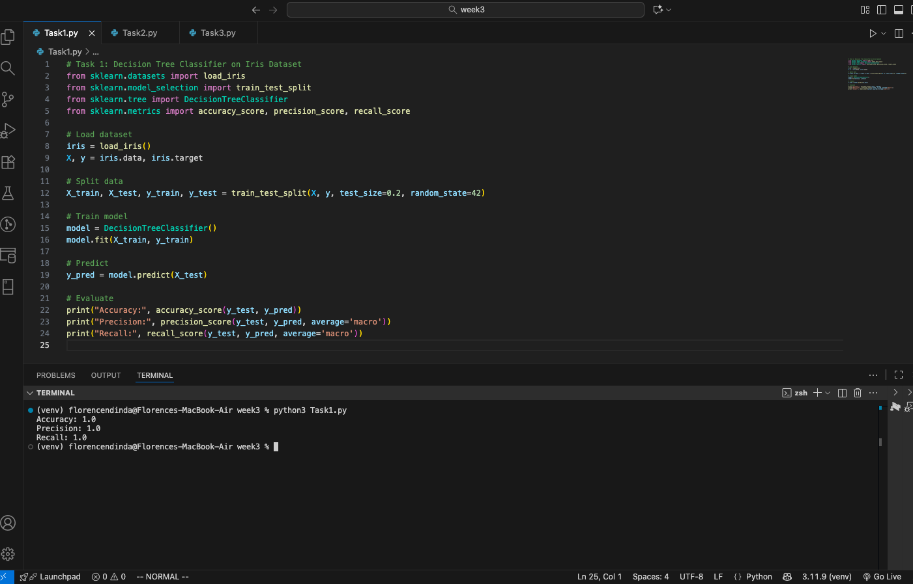
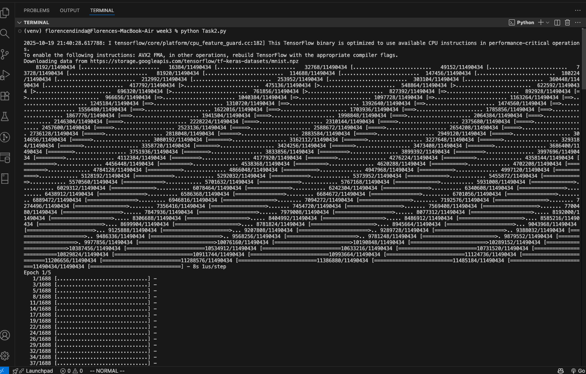
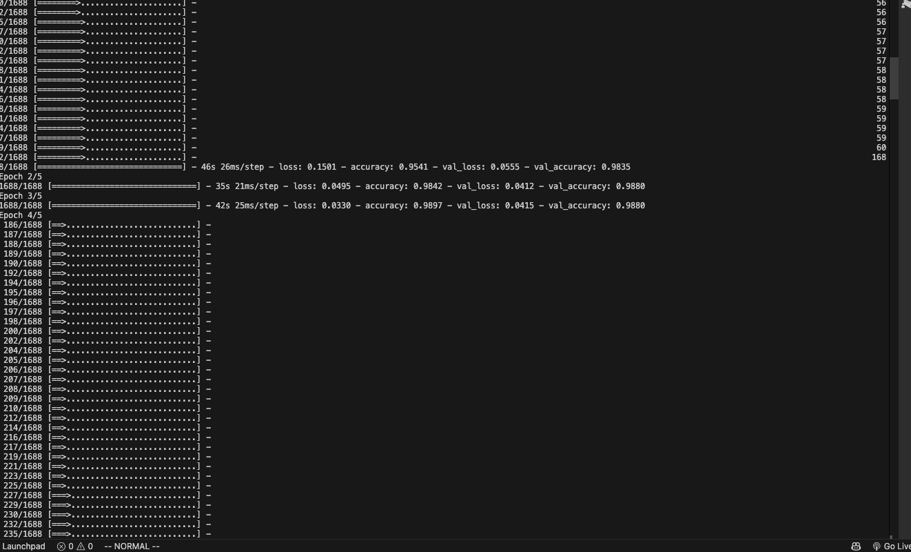
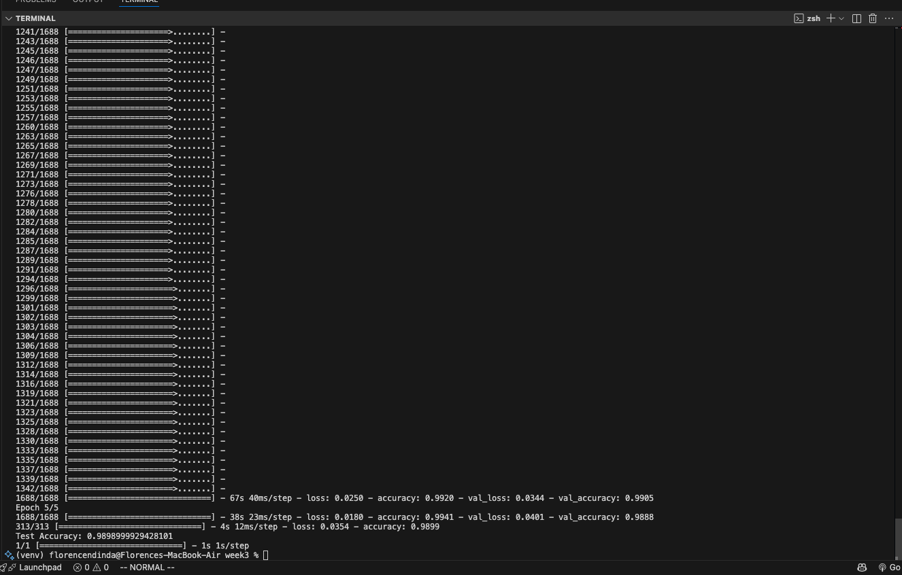
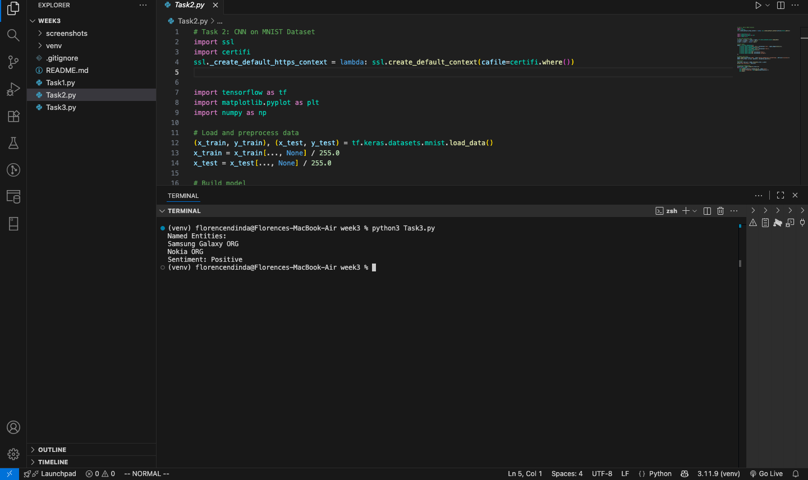
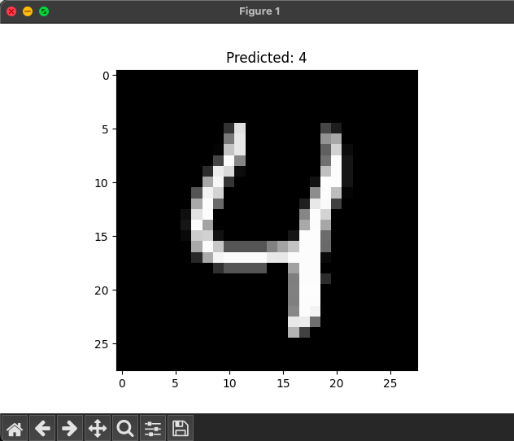
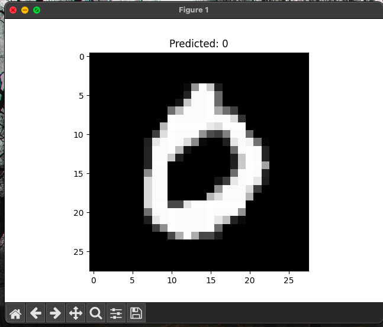
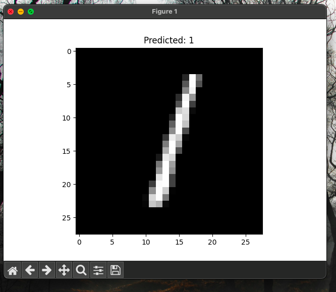
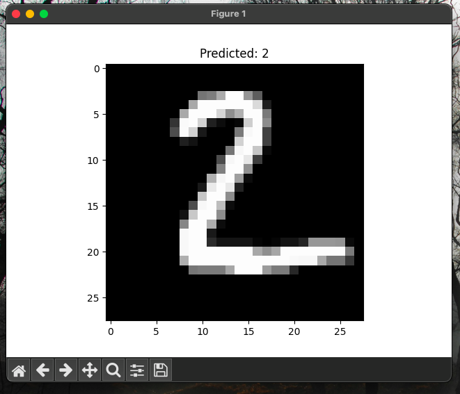
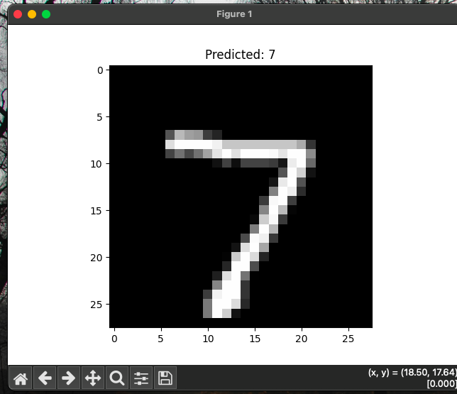

# Week 3: AI for Software Development – MNIST, NLP, and Classification Tasks

This repository contains three Python tasks exploring machine learning and natural language processing using TensorFlow, scikit-learn, and spaCy. Each task demonstrates a different application of AI in software development, from image classification to sentiment analysis.

---

## Setup Instructions

1. Clone the repository and navigate to the project folder:
   ```bash
   git clone <your-repo-link>
   cd week3
   ```

2. Create and activate a virtual environment:
   ```bash
   python3 -m venv venv
   source venv/bin/activate
   ```

3. Install dependencies:
   ```bash
   pip install -r requirements.txt
   python -m spacy download en_core_web_sm
   ```

---

##  Task Summaries

### Task 1: Iris Dataset Classification
- Uses `scikit-learn` to train a classifier on the Iris dataset.
- Outputs accuracy, precision, and recall metrics.
- Demonstrates basic supervised learning and model evaluation.

**Screenshot:**



---

### Task 2: MNIST Digit Recognition with TensorFlow
- Loads and trains a neural network on the MNIST dataset.
- Achieves ~99% accuracy on training and validation sets.
- Displays predicted digits using `matplotlib`.

**Screenshots:**

- Training summary and accuracy:
  

- Digit predictions:
  

- Sample digit visualization:
  

---

### Task 3: Named Entity Recognition and Sentiment Analysis
- Uses `spaCy` to extract named entities from a sample sentence.
- Applies rule-based sentiment classification.

**📷 Screenshot:**



Example output:
```
Named Entities:
Samsung Galaxy ORG
Nokia ORG
Sentiment: Positive
```
```

---

## Screenshot Gallery (Task 2 Predictions)

| Digit | Prediction |
|-------|------------|
|  | Predicted: 4 |
|  | Predicted: 0 |
|  | Predicted: 1 |
|  | Predicted: 2 |
|  | Predicted: 7 |

---

## Theory Questions

### 1. What is the difference between supervised and unsupervised learning?
- **Supervised learning** uses labeled data to train models (e.g., classification, regression).
- **Unsupervised learning** finds patterns in unlabeled data (e.g., clustering, dimensionality reduction).

### 2. What is overfitting and how can it be prevented?
- **Overfitting** occurs when a model learns noise instead of signal, performing well on training data but poorly on unseen data.
- **Prevention techniques** include:
  - Cross-validation
  - Regularization (L1/L2)
  - Dropout
  - Early stopping
  - Using more training data

### 3. What are precision, recall, and F1-score?
- **Precision**: Correct positive predictions / Total predicted positives  
- **Recall**: Correct positive predictions / Total actual positives  
- **F1-score**: Harmonic mean of precision and recall

---

